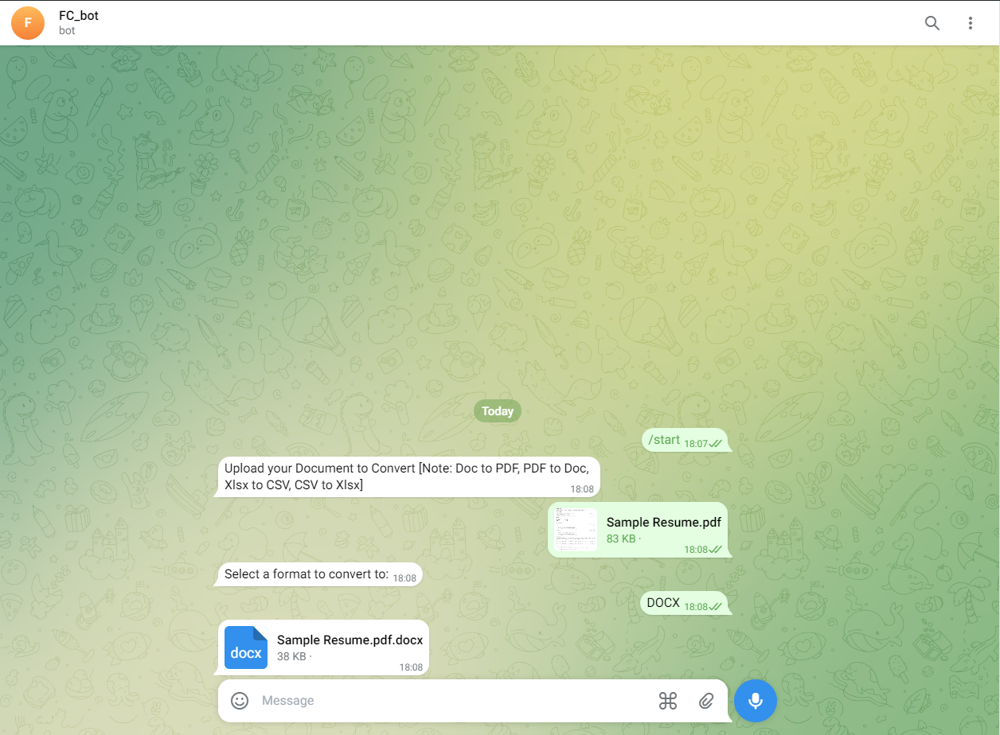

# Document Conversion Bot

This Telegram bot facilitates document conversion between different formats:

- **DOCX to PDF**
- **PDF to DOCX**
- **XLSX to CSV**
- **CSV to XLSX**

Install dependencies:
```sh
pip install -r requirements.txt
```

## Setup

1. Obtain a Telegram Bot API token from [BotFather](https://core.telegram.org/bots#botfather).
2. Replace the placeholder token in `main.py` with your actual Telegram Bot API token.

## Running the Bot

Run the bot:
```sh
python main.py
```

## Usage

1. Start a chat with your bot on Telegram.
2. Send the `/start` command to the bot.
3. Upload a document. Supported formats are DOCX, PDF, XLSX, and CSV.
4. Select a format to convert the document to using the provided options.
5. The bot will convert the document and send it back to you.




```

